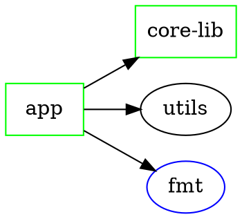

# cforge tree Extensions Design

**Date:** 2026-03-21
**File:** `src/core/commands/command_tree.cpp`

---

## Overview

Two extensions to `cforge tree`:

- **Feature A** — Workspace inter-project dependency graph printed before the external dep tree.
- **Feature D** — Duplicate/conflict detection with optional `--check` flag for detailed output and exit code 1.

New flags: `--check`, `--format dot`.

---

## Data Structures

```cpp
// New: single directed edge in the inter-project graph
struct project_graph_edge {
    std::string from;  // workspace project name
    std::string to;    // target workspace project name
};

// New: one external dep occurrence, keyed per project
struct dep_occurrence {
    std::string project;  // workspace project that owns this dep
    std::string version;  // version string (may be empty)
    std::string type;     // "index", "git", "vcpkg", "system", "project"
};

// New: conflict report for a single dep name
struct dep_conflict {
    std::string dep_name;
    std::vector<dep_occurrence> occurrences;  // only entries with mismatched versions
};
```

The existing `dependency_info` and `project_graph_edge` both live in the anonymous namespace.

---

## New Functions

### `collect_project_dependencies()`

```cpp
// Scans every project in the workspace for inter-project deps.
// A dep is "inter-project" when:
//   1. [dependencies.project] subtable exists with a key matching another
//      workspace project name, OR
//   2. A new-style dep entry has .path or .project key whose resolved name
//      matches a sibling workspace project name.
// Returns one edge per (from, to) pair found. Duplicates suppressed.
std::vector<project_graph_edge> collect_project_dependencies(
    const cforge::workspace &ws);
```

Implementation notes:
- Iterate `ws.get_projects()`, load each `cforge.toml` via `toml_reader`.
- For old-style: `config.get_table_keys("dependencies.project")`, cross-reference against workspace project names.
- For new-style: iterate `config.get_table_keys("dependencies")`, skip `special_keys`, check `has_key(key + ".path")` or `has_key(key + ".project")`, match dep name against workspace project name set.
- Do not add self-edges.

---

### `print_project_graph()`

```cpp
// Renders the "Project graph:" block.
// project_names: all workspace project names in workspace order.
// edges: output of collect_project_dependencies().
void print_project_graph(
    const std::vector<std::string> &project_names,
    const std::vector<project_graph_edge> &edges);
```

**Exact output format:**

```
  Project graph:
       app -> core-lib, utils
  core-lib -> (none)
     utils -> core-lib
```

Formatting rules:
- Two-space indent before each row.
- Project name right-aligned to `max_name_len` characters.
- ` -> ` separator.
- If no outgoing edges: `fmt::format(fg(fmt::color::gray) | fmt::emphasis::faint, "{}", "(none)")`.
- If outgoing edges: comma-separated list of target names, each colored `fg(fmt::color::green) | fmt::emphasis::bold`.
- The left-hand project name also colored `fg(fmt::color::green) | fmt::emphasis::bold`.
- Blank line printed after the block via `logger::print_blank()`.

Implementation sketch:

```cpp
void print_project_graph(
    const std::vector<std::string> &project_names,
    const std::vector<project_graph_edge> &edges)
{
    // Build adjacency: name -> sorted list of targets
    std::map<std::string, std::vector<std::string>> adj;
    for (const auto &n : project_names) adj[n] = {};
    for (const auto &e : edges) adj[e.from].push_back(e.to);

    size_t max_len = 0;
    for (const auto &n : project_names)
        max_len = std::max(max_len, n.size());

    logger::print_plain("  Project graph:");
    for (const auto &n : project_names) {
        std::string padded = fmt::format("{:>{}}", "", max_len - n.size())
                           + fmt::format(fg(fmt::color::green) | fmt::emphasis::bold, "{}", n);
        const auto &targets = adj[n];
        std::string rhs;
        if (targets.empty()) {
            rhs = fmt::format(fg(fmt::color::gray) | fmt::emphasis::faint, "(none)");
        } else {
            for (size_t i = 0; i < targets.size(); ++i) {
                if (i) rhs += ", ";
                rhs += fmt::format(fg(fmt::color::green) | fmt::emphasis::bold, "{}", targets[i]);
            }
        }
        logger::print_plain("  " + padded + " -> " + rhs);
    }
    logger::print_blank();
}
```

---

### `detect_conflicts()`

```cpp
// Groups external deps across all workspace projects by name.
// Returns only names that appear at two or more distinct non-empty versions.
// "project"-type deps are excluded (inter-project refs are not conflicts).
// roots: the per-project root list built in the workspace branch of
//        cforge_cmd_tree(); each root.second.type == "project" is the
//        workspace project node whose .children are its external dep names,
//        and all_deps holds the dep details.
std::vector<dep_conflict> detect_conflicts(
    const std::vector<std::pair<std::string, dependency_info>> &roots,
    const std::map<std::string, dependency_info> &all_deps);
```

Algorithm:
```
map<dep_name, vector<dep_occurrence>> by_name;
for each (proj_name, proj_info) in roots:
    for each child_name in proj_info.children:
        dep = all_deps[child_name]
        if dep.type == "project": continue
        by_name[child_name].push_back({proj_name, dep.version, dep.type})

conflicts = []
for each (name, occurrences) in by_name:
    versions = set of non-empty occurrence.version values
    if versions.size() > 1:
        conflicts.push_back({name, occurrences})
return conflicts
```

---

### `print_conflicts()`

```cpp
// brief=true  → single-line warning per conflict, no exit code change.
// brief=false → detailed block output (used with --check).
void print_conflicts(
    const std::vector<dep_conflict> &conflicts,
    bool brief);
```

**Brief mode** (always printed after the summary when conflicts exist):

```
     warning: fmt has conflicting versions: 11.1.4 (app), 10.2.0 (utils)
```

Uses `logger::print_warning(msg)` for each conflict. The message string:

```cpp
std::string msg = dep.dep_name + " has conflicting versions: ";
for (size_t i = 0; i < dep.occurrences.size(); ++i) {
    if (i) msg += ", ";
    msg += dep.occurrences[i].version + " (" + dep.occurrences[i].project + ")";
}
logger::print_warning(msg);
```

**Detailed mode** (`--check`, `brief=false`):

```
  Conflicts:
     warning: fmt has conflicting versions
              app requires 11.1.4 (index)
              utils requires 10.2.0 (index)
  2 dependency conflicts found
```

```cpp
logger::print_plain("  Conflicts:");
for (const auto &c : conflicts) {
    logger::print_warning(c.dep_name + " has conflicting versions");
    for (const auto &o : c.occurrences) {
        logger::print_plain(
            fmt::format("             {} requires {} ({})",
                        o.project, o.version, o.type));
    }
}
logger::print_plain(
    fmt::format("  {} dependency conflict{} found",
                conflicts.size(), conflicts.size() == 1 ? "" : "s"));
```

---

### `emit_dot()`

```cpp
// Writes a Graphviz DOT representation to stdout (via logger::print_plain).
// workspace_name: used as the digraph identifier.
// project_names: all workspace projects (rendered as box nodes, color=green).
// edges: inter-project edges.
// roots / all_deps: external dep edges (external nodes are ellipse, color=blue).
// Only project nodes and their direct external deps are emitted; transitive
// children of external deps are omitted for readability.
void emit_dot(
    const std::string &workspace_name,
    const std::vector<std::string> &project_names,
    const std::vector<project_graph_edge> &edges,
    const std::vector<std::pair<std::string, dependency_info>> &roots,
    const std::map<std::string, dependency_info> &all_deps);
```

**Exact output format:**



Rules:
- Project nodes declared first (all `[shape=box, color=green]`).
- Inter-project edges next.
- External dep nodes declared on first reference (`[shape=ellipse, color=blue]`), immediately before or after — deduplicated via a `std::set<std::string> declared_ext`.
- External dep edges follow, one per (project, dep) pair.
- "project"-type children in `proj_info.children` are skipped (already covered by inter-project edges).
- All identifiers quoted.

---

## Changes to `cforge_cmd_tree()`

### Argument parsing additions

```cpp
bool check_mode = false;
bool dot_format = false;

// Inside the args loop:
if (arg == "--check") {
    check_mode = true;
} else if (arg == "--format" && i + 1 < ctx->args.arg_count) {
    std::string fmt_val = ctx->args.args[++i];
    if (fmt_val == "dot") dot_format = true;
}
```

### Workspace branch additions

After `ws.load()` succeeds, before printing the per-project external dep tree:

```cpp
// 1. Collect inter-project graph
std::vector<project_graph_edge> proj_edges =
    collect_project_dependencies(ws);

// 2. Build project name list (workspace order)
std::vector<std::string> proj_names;
for (const auto &p : ws.get_projects()) proj_names.push_back(p.name);

// 3. DOT short-circuit (replaces all normal output)
if (dot_format) {
    emit_dot(ws.get_name(), proj_names, proj_edges, roots, all_deps);
    return 0;
}

// 4. Print project graph section (before "External dependencies:")
print_project_graph(proj_names, proj_edges);
logger::print_plain("  External dependencies:");
```

After the existing summary block:

```cpp
// 5. Conflict detection (always)
auto conflicts = detect_conflicts(roots, all_deps);
if (!conflicts.empty()) {
    if (check_mode) {
        print_conflicts(conflicts, /*brief=*/false);
        return 1;
    } else {
        print_conflicts(conflicts, /*brief=*/true);
    }
}
```

### Single-project branch

No changes. Project graph and conflict detection are workspace-only.
`--check` with a single project returns 0 (no cross-project conflicts possible).
`--format dot` for a single project: emit a minimal digraph with just that project's external deps.

---

## Output Layout (full workspace example)

```
my-workspace (workspace)

  Project graph:
       app -> core-lib, utils
  core-lib -> (none)
     utils -> core-lib

  External dependencies:
  |-- app
  |   |-- fmt (index) @ 11.1.4
  |   `-- spdlog (index) @ 1.12.0
  |-- core-lib
  |   `-- zlib (system)
  `-- utils
      `-- fmt (index) @ 10.2.0

Dependencies: 3 index, 1 system

     warning: fmt has conflicting versions: 11.1.4 (app), 10.2.0 (utils)
```

---

## Logger API Usage Summary

| Purpose | Call |
|---|---|
| Workspace name header | `logger::print_emphasis(ws.get_name() + " (workspace)")` |
| Plain lines (graph rows, DOT, section labels) | `logger::print_plain(str)` |
| Conflict warnings (brief and detailed) | `logger::print_warning(msg)` |
| Blank separator | `logger::print_blank()` |
| Bold green project name in graph | `fmt::format(fg(fmt::color::green) \| fmt::emphasis::bold, "{}", name)` |
| Dim gray `(none)` | `fmt::format(fg(fmt::color::gray) \| fmt::emphasis::faint, "(none)")` |

---

## File Touched

`src/core/commands/command_tree.cpp` only. No header changes required; all new functions are in the existing anonymous namespace.
